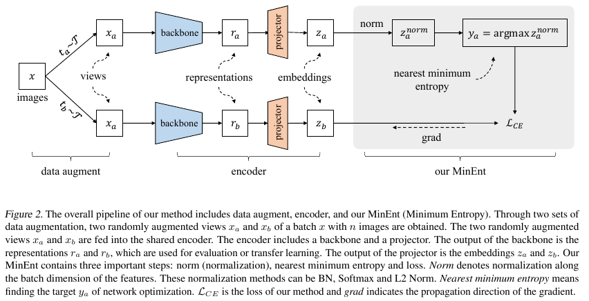

## The code of MinEnt: Minimum Entropy for Self-Supervised Representation Learning


## Abstract

> Self-supervised representation learning is becoming more and more popular due to its superior performance. According to the information entropy theory, the smaller the information entropy of a feature, the more certain it is and the less redundant it is. Based on this, we propose a simple yet effective self-supervised Minimum Entropy representation learning framework (MinEnt). From the perspective of reducing information entropy, our MinEnt takes the output of the projector towards its nearest minimum entropy as the optimization target. The core of our MinEnt consists of three simple yet important steps: 1) normalize along the batch dimension to avoid model collapse, 2) compute the nearest minimum entropy to get the target, 3) compute the loss and backpropagate to optimize the network. Our MinEnt can learn efficient representations, even without the need for techniques such as negative sample pairs, predictors, momentum encoders, cross-correlation matrices, etc. Experimental results on five widely used datasets show that our method achieves competitive results in a simple manner.


## Pipeline




## Train and Test

```
python ./MinEnt/runner.py gpu_id=0 dataset_name=cifar10 norm_name=BN
```

```
python ./MinEnt/runner.py gpu_id=0 dataset_name=cifar100 norm_name=BN
```

```
python ./MinEnt/runner.py gpu_id=0 dataset_name=stl10 norm_name=BN
```

```
python ./MinEnt/runner.py gpu_id=0 dataset_name=tiny norm_name=BN
```

```
python ./MinEnt/runner.py gpu_id=0 dataset_name=imagenet100 norm_name=BN
```


## Core Code

> `./MinEnt/model.py`


```
class BaseMethod(nn.Module):

    def __init__(self, cfg):
        super().__init__()
        self.model, self.out_size = self.get_backbone(cfg)
        pass

    @staticmethod
    def get_backbone(cfg):
        model = getattr(models, cfg.arch)(pretrained=False)
        if "imagenet" not in cfg.dataset_name:
            model.conv1 = nn.Conv2d(3, 64, kernel_size=3, stride=1, padding=1, bias=False)
        if cfg.dataset_name == "cifar10" or cfg.dataset_name == "cifar100":
            model.maxpool = nn.Identity()
        out_size = model.fc.in_features
        model.fc = nn.Identity()
        return model, out_size

    @staticmethod
    def get_head(out_size, cfg, emb):
        x = []
        in_size = out_size
        for _ in range(cfg.head_layers - 1):
            x.append(nn.Linear(in_size, cfg.head_size))
            if cfg.add_bn:
                x.append(nn.BatchNorm1d(cfg.head_size))
            x.append(nn.ReLU())
            in_size = cfg.head_size
        x.append(nn.Linear(in_size, emb))
        return nn.Sequential(*x)

    pass


class MinEntOneHead(BaseMethod):

    def __init__(self, cfg):
        super().__init__(cfg=cfg)

        self.head = self.get_head(self.out_size, cfg, cfg.emb)
        self.norm = NormMethod(cfg.emb, norm_name=cfg.norm_name)

        self.criterion = nn.CrossEntropyLoss()
        pass

    def forward(self, samples):
        f1 = self.model(samples[0].cuda(non_blocking=True))
        f2 = self.model(samples[1].cuda(non_blocking=True))
        g1, g2 = self.head(f1), self.head(f2)
        h1, h2 = self.norm(g1), self.norm(g2)
        t1, t2 = h1.argmax(dim=1), h2.argmax(dim=1)
        return 0.5 * (self.criterion(g1, t2) + self.criterion(g2, t1))
```


## Conclusion

> This paper proposes a novel, simple and effective self-supervised representation learning method based on Minimum Entropy (MinEnt). From the perspective of reducing information entropy, our proposed MinEnt takes the nearest minimum entropy of the output of the projector as the optimization objective. Our method can learn useful representations even without the need for negative sample pairs, predictors, momentum encoders, cross-correlation matrices, etc. Our experiments show that normalization techniques along the batch dimension, such as BN, Softmax and L2 Norm, can effectively avoid model collapse in our method. Extensive experimental results on five widely used datasets show that our method can achieve competitive results.


## Thank you

Thank you for you time!


